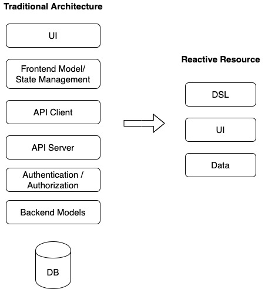

# ⚛️ ReactiveResource (WIP)
A fullstack component library that is productive and fun

## 🚀 Features
* Modern UI - easy to customize
* Authenitcation
* Authorization
* Self-hosted - own your data
* Pre-assembeled - spend zero time assembling common components
* Less-code - write less, accomplish more
* Conventions over Configurations - forget spending days configuring your project, start in minutes
* Fullstack - actually persist your data to a database
* 🤪 FUN 🤪

## Getting Started

```bash
rails new MyApp
cd MyApp

yarn add reactive-resource-ui

echo -e "gem 'reactive-resource-data'" >> Gemfile
bundle install
```

## Usage

```ruby
# app.rb

title 'Rain'
subtitle 'Random Things & Random Prices'

resources :users, fields: [:name, :email, :password, :phone]
resources :orders, fields: [:user, :total, :taxes, :line_items]
resources :line_items, fields: [:product, :quantity, :order]
resources :product, fields: [:name, :price, :image]
```

To specify computed values and business rules you can simply peel back a layer by creating a new file like this:

```ruby
# app/models/user.rb
class Order < ReactiveResource::Model
  def total
    line_items.sum(0, &:price)
  end
end
```

This will extend the dynamically generated model and allow you to add additional things into it.

You can extend and overwrite each layer to suit your needs.

## Architecture

- `reactive-resource-ui` - Dynamic frontend components that can be arranged together
- `reactive-resource-data` - Dynamic backend compoents to manage the business logic and database state
- `reactive-resource-dsl` - Domain Specific Language that ties together the UI & Data layers using a sementic language.



## 🚗 Under the hood
* React
* Ant UI
* Rails
* Postgres
* Graphql + RESTful

## Motivation
Building Data-Driven Web Apps today involves integrating a lot of moving pieces. It typically involves picking your own stack -- frontend framework, backend framework, api layer (graphql/restful), authentication, ui framework and database engine. Integrating all the pieces to work in a cohesive way to input and display data can be daunting. 

The basis of CRUD application and requirements haven't changed much since the early 2000s, but it is more difficult than ever to create those same tables and forms.

We grew tired of writing the same glue code for every project and new technology that came along. This is our attempt to provide a unified system of components that is vertically integrated and fun to use.

There were a few great libraries that came along that ispired us and we wanted to take it to the next level.

## Inspiration

- [ActiveAdmin](https://activeadmin.info/) - Brillant admin library that makes it possible to create tables, forms and detail pages for any CRUD rails app in a few keystrokes.
- [AgileToolkit](https://www.agiletoolkit.org/) - Full-stack PHP component library that provides you all the standard CRUD components you would need
- [ForestAdmin](https://www.forestadmin.com/) - SaaS Admin intefrace for your API
- [Jumpstart](https://github.com/excid3/jumpstart/) - Starter kit for Rails projects includes a full set of tools to create a SaaS app
- [Liason](https://liaison.dev/) - A unified architecture to provide RPC like app development model. Checkout the [excellent article about this architecture](https://www.freecodecamp.org/news/full-stack-unified-architecture/).
- [ReactAdmin](https://marmelab.com/react-admin/) - A frontend web framework for B2B applications
- [Strapi](https://strapi.io/) - Headless CMS with feature rich interface to help you manage your custom data. Full-stack node.js. 
- [Terstle](https://trestle.io/) - Admin building framework similar to ActiveAdmin but with responsive deisgn principles


